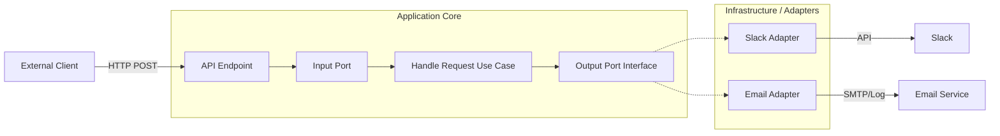

# Notifier API - Hexagonal Notification Service

[](https://www.python.org/downloads/)
[](https://flask.palletsprojects.com/)
[](tests/)
[](https://www.docker.com/)
[](https://alistair.cockburn.us/hexagonal-architecture/)
[](LICENSE)

**A production-ready, scalable notification routing service built with Python (Flask) and Hexagonal Architecture (Ports & Adapters).**

This service acts as a centralized hub that ingests assistance requests via webhooks, routes them based on business rules (topics), and dispatches them to appropriate channels (Slack, Email, etc.) using a modular adapter system.

## 🚀 Key Features

- **Hexagonal Architecture (Ports & Adapters)**: Decouples core business logic from external dependencies (Flask, Slack, Email), enabling easy testing and maintenance.
- **Modular & Extensible**: New notification channels (e.g., SMS, Discord, Jira) can be added by simply implementing the `NotificationChannel` interface.
- **Robust Error Handling**: Graceful degradation and comprehensive logging for external API failures.
- **Dockerized**: Fully containerized with Nginx as a reverse proxy for production-grade deployment.
- **Clean Code**: Follows SOLID principles and utilizes Factory patterns for dependency injection.

## 🏗️ Architecture

The application is structured to isolate the domain logic from the infrastructure.



### Core Components

- **Domain**: Defines the `AssistanceRequest` model.
- **Ports**: Interfaces (`NotificationChannel`) that define how the application interacts with the outside world.
- **Adapters**:
  - **Input**: Flask API endpoints that translate HTTP requests into domain commands.
  - **Output**: Implementations for Slack and Email that translate domain events into external API calls.
- **Use Cases**: `HandleAssistanceRequest` orchestrates the flow and applies routing rules.

## 🛠️ Tech Stack

- **Language**: Python 3.11+
- **Web Framework**: Flask
- **Serialization**: Marshmallow / APIFairy
- **Containerization**: Docker & Docker Compose
- **Server**: Nginx (Reverse Proxy), Gunicorn (Production Server - implied capability)
- **Testing**: Pytest

## ⚡ Quick Start

### Prerequisites

- Docker & Docker Compose OR Python 3.11+ & Poetry

### Option A: Run with Docker (Recommended)

Get the system running in under 2 minutes.

1.  **Clone the repository**:

    ```bash
    git clone https://github.com/yourusername/notifier-api.git
    cd notifier-api
    ```

2.  **Configure Environment**:
    Create a `.env` file in the root directory

    ```bash
    # Minimal config for local run
    SLACK_BOT_TOKEN=<your_slack_bot_token>
    SLACK_CHANNEL_ID=<target_slack_channel_id>
    ```

3.  **Start the Service**:

    ```bash
    sh docker/run.sh -d up
    ```

    The API will be available at `http://localhost:8080/v1/notify`.

4.  **Stop**:
    ```bash
    sh docker/run.sh down
    ```

### Option B: Run Locally (Poetry)

```bash
# Install dependencies
poetry install

# Activate shell
poetry shell

# Run Flask development server
flask run
# Accessible at http://localhost:5000
```

## 🔌 API Documentation

### Send Notification

**POST** `/v1/notify`

Routes an assistance request to the configured channel based on the `topic`.

**Request Body:**

```json
{
  "topic": "sales",
  "description": "Customer needs help with Enterprise plan."
}
```

- `topic`: "sales" (routes to Slack) or "pricing" (routes to Email/Log).
- `description`: Detailed message.

**Try it out:**

```bash
# Docker (Port 8080)
curl -X POST http://localhost:8080/v1/notify \
  -H "Content-Type: application/json" \
  -d '{"topic": "sales", "description": "Customer needs help with Enterprise plan."}'

# Local (Port 5000)
curl -X POST http://localhost:5000/v1/notify \
  -H "Content-Type: application/json" \
  -d '{"topic": "sales", "description": "Customer needs help with Enterprise plan."}'
```

**Response (202 Accepted):**

```json
{
  "message": "Request received and processing."
}
```

### Health Check

**GET** `/v1/health`
Returns `{"status": "ok"}` for load balancers.

**Try it out:**

```bash
# Docker
curl http://localhost:8080/v1/health

# Local
curl http://localhost:5000/v1/health
```

## 🧪 Testing

The project includes a comprehensive test suite using `pytest`.

```bash
# Run all tests
poetry run pytest

# Run with coverage report
poetry run pytest --cov=app
```

## 📝 Design Decisions

1.  **Hexagonal Architecture**: Chosen to ensure the core routing logic remains independent of the web framework. This allows swapping Flask for FastAPI or Django without touching the business rules.
2.  **Factory Pattern**: Used in `create_app` to inject dependencies (adapters) into the use cases, facilitating easier testing and configuration management.
3.  **Nginx Proxy**: Included in the Docker composition to simulate a real-world deployment where the application server is behind a robust web server.
